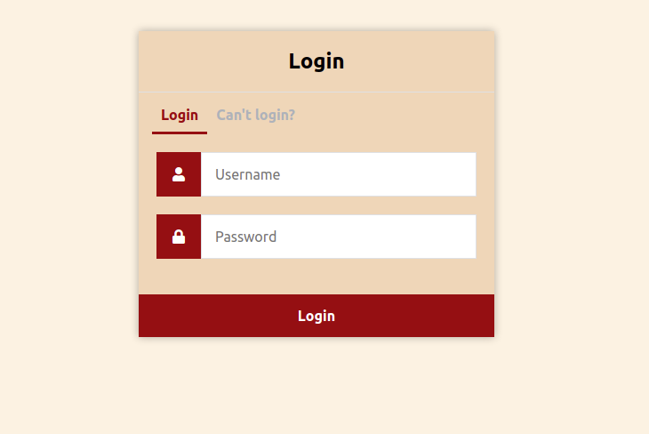
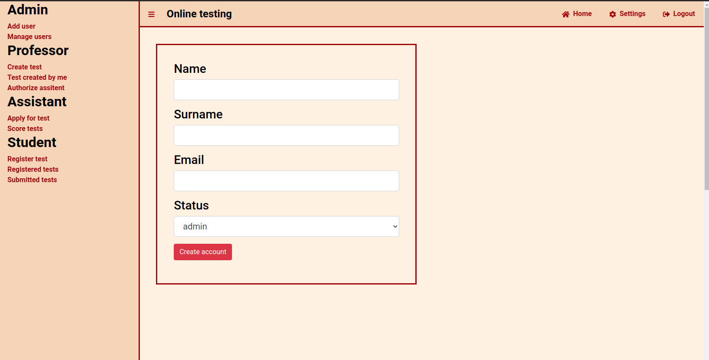

# iis_testing_online
Information system for online testing. Allows creating, filling, evaluating test and work with users (adding users, changing roles, passwords, etc.)  
  
    
Testy: tvorba, plnění a hodnocení testových zkoušek  
Autoři  
Vojtěch Krejčík xkrejc68@stud.fit.vutbr.cz - Návrh databaze, Navrh gui, Zprovoznění hostingu, zaklad backendu  
Jiří Pisk xpiskj00@stud.fit.vutbr.cz - Implementace testů, úprava databáze  
URL aplikace  
http://online-testing.azurewebsites.net/ (jiz nefunguje)  
Uživatelé systému pro testování  
Uveďte prosím existující zástupce všech rolí uživatelů.  

Login	Heslo	Role  
admin@test.com	admin	Administrátor  
student@test.com	student	student  
assistent@test.com	assistent	assistent  
profesor@test.com	profesor	profesor  
  
Instalace  
Je třeba python 3  
pak nainstalovat zavislosti - $pip3 install -r requirements.txt  
$flask run  
vytvoreni tabulek a databaze je v db/db.sql spolecne se ukazkovymi uzivatli  
